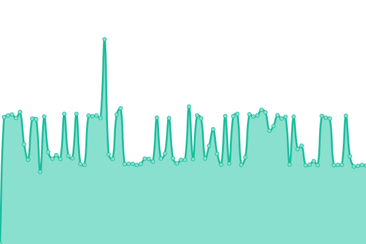
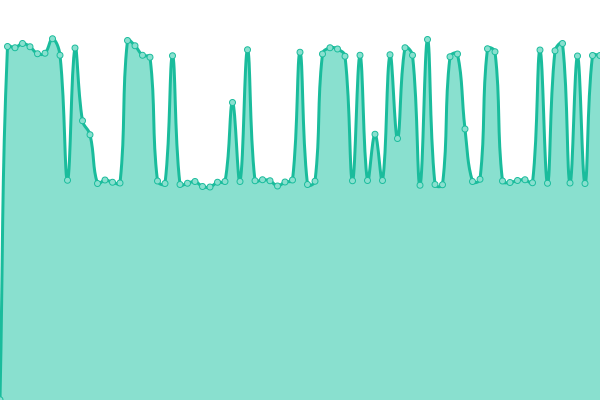
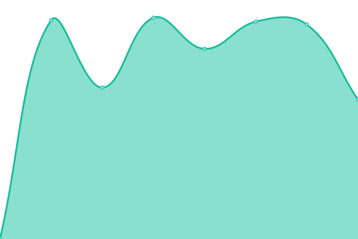
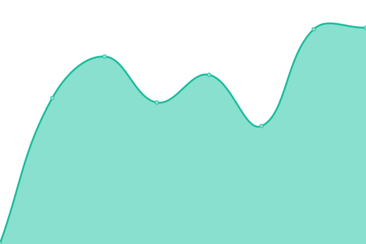

# [📈 Live Status](https://status.gacr.cz): <!--live status--> **🟧 Partial outage**

This repository contains the open-source uptime monitor and status page for [Antonín Boušek](https://kailo.io), powered by [Upptime](https://github.com/upptime/upptime).

With [Upptime](https://upptime.js.org), you can get your own unlimited and free uptime monitor and status page, powered entirely by a GitHub repository. We use [Issues](https://github.com/Kail0/uptime/issues) as incident reports, [Actions](https://github.com/Kail0/uptime/actions) as uptime monitors, and [Pages](https://status.gacr.cz) for the status page.

<!--start: status pages-->
<!-- This summary is generated by Upptime (https://github.com/upptime/upptime) -->
<!-- Do not edit this manually, your changes will be overwritten -->
<!-- prettier-ignore -->
| URL | Status | History | Response Time | Uptime |
| --- | ------ | ------- | ------------- | ------ |
|  [GACR](https://gacr.cz/) | 🟩 Up | [gacr.yml](https://github.com/Kail0/uptime/commits/HEAD/history/gacr.yml) | 

 1081ms
     
 | 

<a href="https://status.gacr.cz/history/gacr">100.00%</a>
    

|  [Mail](https://pigeon.gacr.cz/owa/) | 🟥 Down | [mail.yml](https://github.com/Kail0/uptime/commits/HEAD/history/mail.yml) | 

 1364ms
     
 | 

<a href="https://status.gacr.cz/history/mail">24.85%</a>
    

|  [Mail (bez owa)](https://pigeon.gacr.cz) | 🟥 Down | [mail-bez-owa.yml](https://github.com/Kail0/uptime/commits/HEAD/history/mail-bez-owa.yml) | 

 1253ms
     
 | 

<a href="https://status.gacr.cz/history/mail-bez-owa">25.46%</a>
    

|  [Helpdesk GACR](https://info.gacr.cz) | 🟩 Up | [helpdesk-gacr.yml](https://github.com/Kail0/uptime/commits/HEAD/history/helpdesk-gacr.yml) | 

 938ms
     
 | 

<a href="https://status.gacr.cz/history/helpdesk-gacr">100.00%</a>
    

|  [Kailo](https://kailo.io) | 🟩 Up | [kailo.yml](https://github.com/Kail0/uptime/commits/HEAD/history/kailo.yml) | 

 370ms
     
 | 

<a href="https://status.gacr.cz/history/kailo">100.00%</a>
    

|  [Kailo | Speedtest](https://speedtest.kailo.io) | 🟩 Up | [kailo-speedtest.yml](https://github.com/Kail0/uptime/commits/HEAD/history/kailo-speedtest.yml) | 

 424ms
     
 | 

<a href="https://status.gacr.cz/history/kailo-speedtest">100.00%</a>
    

|  [GRIS](https://gris.cz/) | 🟥 Down | [gris.yml](https://github.com/Kail0/uptime/commits/HEAD/history/gris.yml) | 

 0ms
     
 | 

<a href="https://status.gacr.cz/history/gris">0.00%</a>
    

|  [GRIS login](https://cas.gris.cz/cas/login) | 🟥 Down | [gris-login.yml](https://github.com/Kail0/uptime/commits/HEAD/history/gris-login.yml) | 

 0ms
     
 | 

<a href="https://status.gacr.cz/history/gris-login">0.00%</a>
    

<!--end: status pages-->

[**Visit our status website →**](https://status.gacr.cz)

## 📄 License

- Powered by: [Upptime](https://github.com/upptime/upptime)
- Code: [MIT](./LICENSE) © [Antonín Boušek](https://kailo.io)
- Data in the `./history` directory: [Open Database License](https://opendatacommons.org/licenses/odbl/1-0/)
